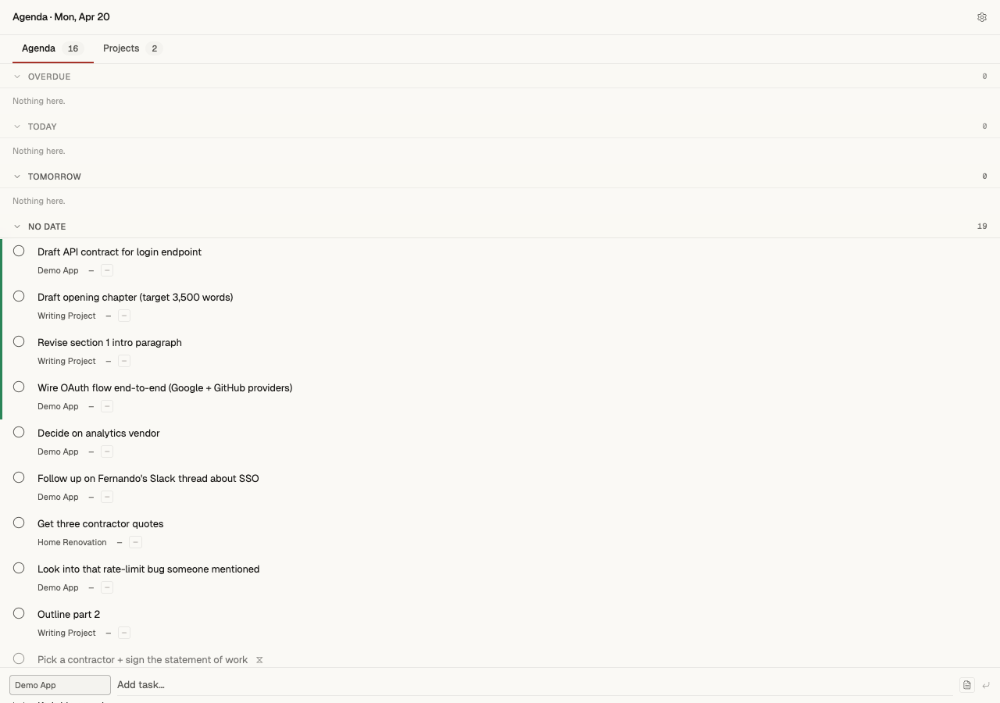
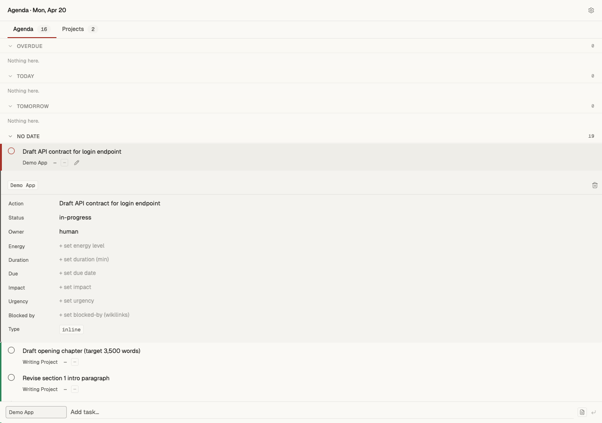
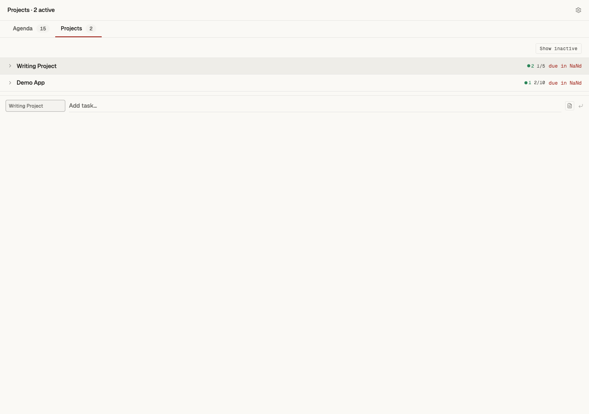
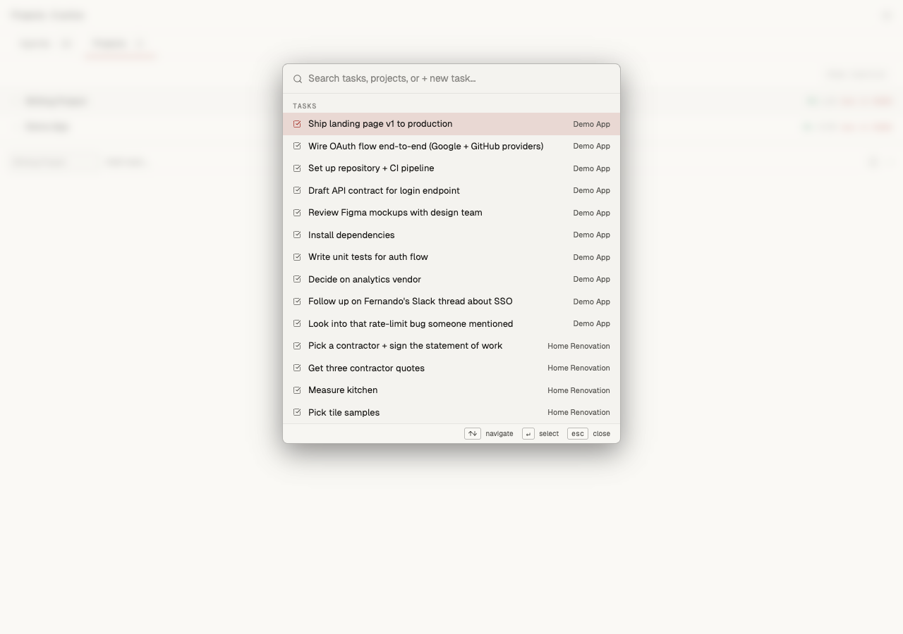

# task-sidebar

> A hand-crafted sidebar for task + project management over any PARA-structured Obsidian-style markdown vault. Zero ceremony, full undo, 100% keyboard, Claude Code-agent-friendly.


| Agenda tab (default) | Task detail panel |
|:---:|:---:|
|  |  |
| **Projects tab** with health chips | **⌘K command palette** |
|  |  |

## 30-second quickstart

```bash
git clone https://github.com/pushREC/task-sidebar
cd task-sidebar
pnpm install
pnpm dev
```

Opens on `http://127.0.0.1:5174`. Reads from the bundled `sample-vault/` out of the box. Point at your own PARA vault by setting `VAULT_ROOT` — see [`.env.example`](.env.example).

## Why this exists

Most task managers force your tasks into their database. This one reads + writes plain markdown files in an Obsidian-compatible PARA structure. Your tasks live as:

- **Inline tasks** — `- [ ] action text @owner(...)` lines in `1-Projects/<slug>/tasks.md`
- **Entity tasks** — full markdown files in `1-Projects/<slug>/tasks/<slug>.md` with rich frontmatter

Both forms render in the same sidebar. You can promote inline → entity with a single field edit (Lock #5). Status transitions go through a state machine (Lock #9). Priority is **inferred from impact + urgency + due + parent-goal timeframe** at read time, never stored (Lock #8). Deletes are real-undoable via tombstones — hit `⌘Z` within 5s and the file is restored byte-identical.

Built over ~25 sprint-days of Plan I (Sprints A→G, 164 findings fixed, 20 convergence rounds) + Plan II Sprint H (Safety + Recoverability: error-dot persistence, mtime optimistic lock, tombstone delete system) + 2 rounds of `/cognitive-supremacy` adversarial auditing. The commit history preserves the full arc.

## Feature tour

**Agenda tab** (the default) — time-bucketed tasks across all your projects:
- Overdue (accent red, AlertCircle icon) · Today · Tomorrow · This Week · Next Week/Later (auto-splits at threshold 10) · No date
- Done tasks inline with strikethrough (70% opacity). Cancelled tasks hidden.
- ISO 8601 Monday-Sunday week boundaries.

**Projects tab** — active projects first, `Show inactive` toggle for backlog/blocked/paused. Health chips (overdue count / in-progress count / done ratio) per project.

**Row anatomy** — circle + action + project title + due chip (+3d / today / −2d) + P1–P4 priority pill + pencil-on-hover.

**Command palette** — `⌘K` opens a 4-scope fuzzy search (Tasks · Projects · Tabs · + Create new task). Max 20 results, arrow-key nav.

**Bulk actions** — `Shift+j/k` extends range, `Space` toggles selection, `⌘A` selects all visible. Bottom bar: Done / Move / Cancel / Delete / Clear. Every bulk action has a 5-second undo toast.

**Detail panel** — breadcrumb (goal → project → trash), click-to-edit Property List (status / due / impact / urgency), Notes textarea with mtime optimistic lock (409 + non-destructive conflict banner if another process edits the file mid-compose).

**Keyboard** — `1`/`2` tab switch · `a` quick-add · `j`/`k` nav · `x` toggle · `e` edit · `⌘K` palette · `⌘D` theme cycle · `Esc` collapse.

**Themes** — system / light / dark cycle. Darkroom-Minimal aesthetic with a single accent (red `#d84a3e`), single "ok" emerald (`#3ea372`), muted gray everywhere else. Full a11y: reduced-motion respected, focus-visible rings, WHATWG nested-interactive avoidance, assertive aria-live for mtime conflicts.

## Architecture sketch

```
Browser (React 19 + Zustand)
   │  fetch /api/* (optimistic) + SSE /api/events (live)
   ▼
Express 4 (middleware inside Vite dev server, port 5174)
   │
   ├── server/safety.ts         ← path allowlist + VAULT_ROOT guard (SSoT)
   ├── server/writers/*.ts      ← atomic write per task op + mtime lock + tombstones
   ├── server/vault-index.ts    ← dual-model parser (inline + entity)
   ├── server/watcher.ts        ← chokidar → SSE broadcast on external changes
   └── server/priority.ts       ← optional subprocess to life-os priority_infer.py
   │
   ▼ reads + writes
$VAULT_ROOT/1-Projects/<slug>/{README.md, tasks.md, tasks/<slug>.md}
```

See [`docs/ARCHITECTURE.md`](docs/ARCHITECTURE.md) for the full walkthrough + data flows.

## Docs

| Doc | Audience | What's in it |
|---|---|---|
| [`docs/ARCHITECTURE.md`](docs/ARCHITECTURE.md) | Dev + Claude agents | Server layer / client layer / SSE / watcher / safety invariants |
| [`docs/UI-UX.md`](docs/UI-UX.md) | Designer + dev | Darkroom-Minimal token table, component patterns, motion language, keyboard + a11y, **porting kit appendix** |
| [`docs/DATA-MODEL.md`](docs/DATA-MODEL.md) | Dev + agent | Vault layout, `InlineTask \| EntityTask` discriminated union, frontmatter schemas, lifecycle |
| [`docs/DECISIONS.md`](docs/DECISIONS.md) | Agent (grep-first) | Flat table of 45 locks with source file:line + one-line rationale |
| [`docs/PLANNING-DISCIPLINE.md`](docs/PLANNING-DISCIPLINE.md) | Anyone planning work | Assumption annihilation → irreducible truths → validation through negation → 3-parallel-critic convergence protocol → anti-mediocrity gate |
| [`docs/SECURITY.md`](docs/SECURITY.md) | Reviewer | Path traversal blocks, O_EXCL creates, field allowlist, mtime lock, tombstone safety |
| [`docs/LIFE-OS.md`](docs/LIFE-OS.md) | Optional integration | How to wire priority inference + status reconciliation subprocess scripts |
| [`CLAUDE.md`](CLAUDE.md) | Claude Code agents | Agent governance, architecture locks, quality gates, safety invariants |
| [`templates/plan-file.md`](templates/plan-file.md) | Anyone writing a plan | Fillable plan template following the discipline in `docs/PLANNING-DISCIPLINE.md` |
| [`docs/examples/plan-file-example.md`](docs/examples/plan-file-example.md) | Reference | Sanitized copy of the actual plan that shipped this sidebar |
| [`sample-vault/`](sample-vault/) | First-time runner | Bundled demo vault with 3 projects + 19 tasks covering all states |

## Quality gates

```bash
pnpm tsc --noEmit          # zero TS errors
bash scripts/verify.sh     # 37 checks — read endpoints, SSE, safety blocks,
                           # TOCTOU, 50-parallel toggle race, CRUD round-trips,
                           # AI-tell greps (fonts/icons/colors/console.*)
```

No commit lands without both passing. CI is deferred until a first PR arrives.

## Porting the UI/UX to another dashboard

See [`docs/UI-UX.md` § Porting kit](docs/UI-UX.md#porting-kit). Six copy-paste artifacts. Estimated 4–6 hours to adopt the aesthetic end-to-end.

## License

MIT. See [`LICENSE`](LICENSE).

## Credits

Built with [Claude Code](https://claude.com/claude-code). The convergence discipline (3 parallel critics per sprint: Opus Explore + Gemini CLI + Codex CLI) lives in [`docs/PLANNING-DISCIPLINE.md`](docs/PLANNING-DISCIPLINE.md). Every lock in [`docs/DECISIONS.md`](docs/DECISIONS.md) traces back to a sprint finding you can read in the git history.
